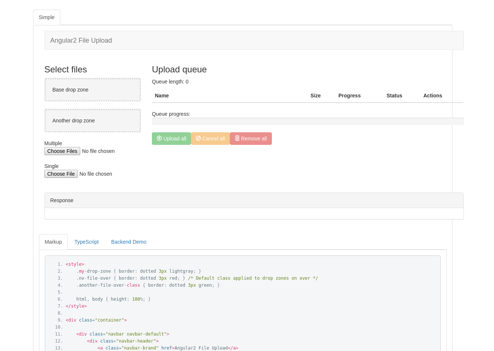
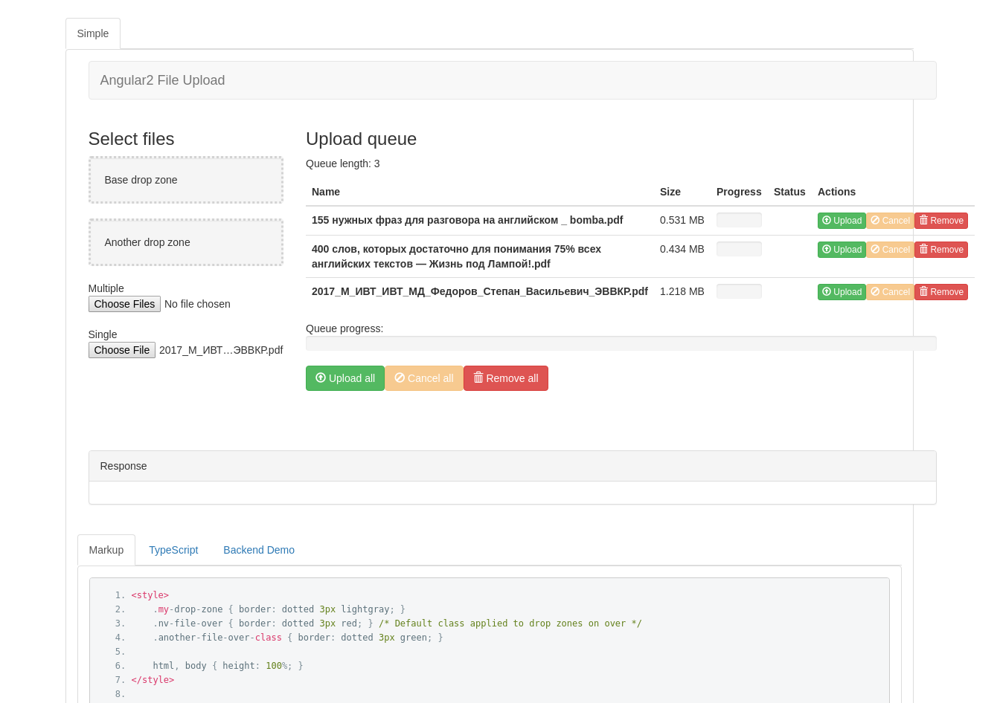
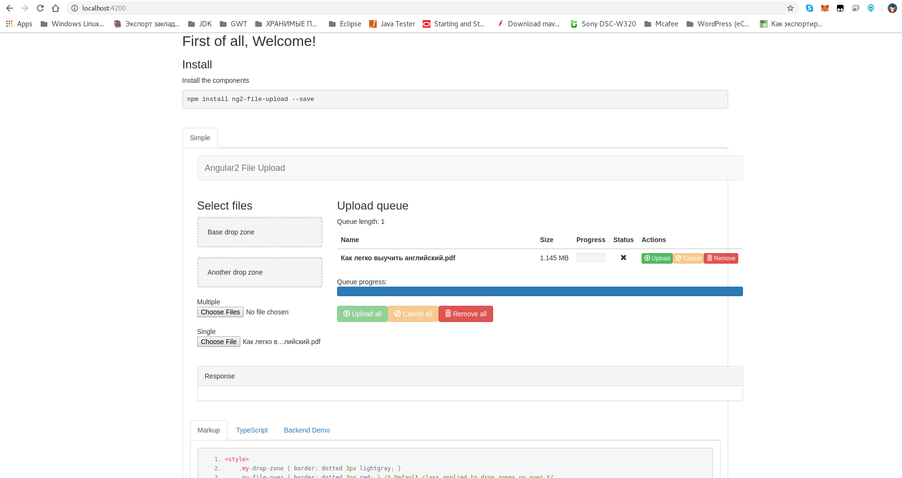
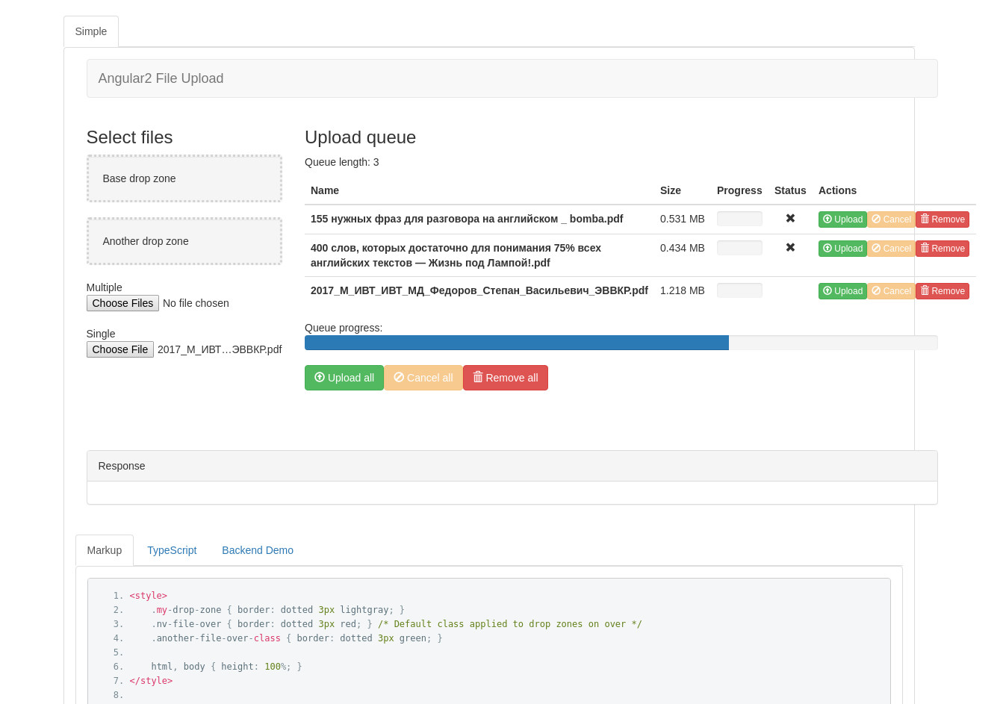
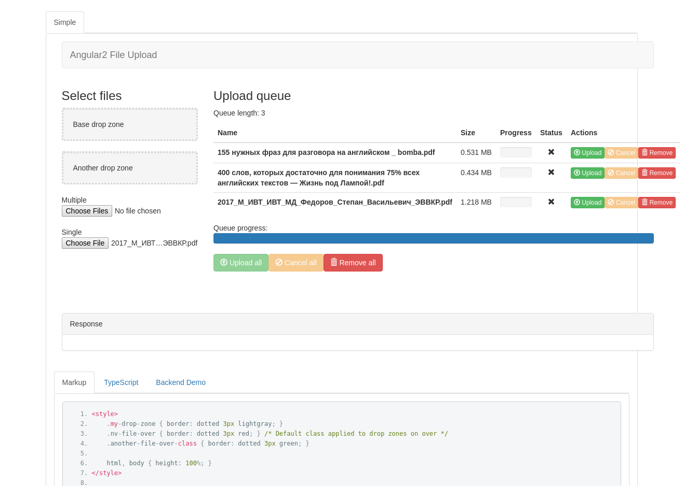

## The Angular File Upload directives "_ng2-file-upload_"

1. Рекомендуемый способ установки ***ng2-file-upload*** через менеджер пакетов [npm](https://www.npmjs.com/search?q=ng2-file-upload) используя команду: `npm i ng2-file-upload --save`.
   Кроме того можно [скачать его в ZIP-файле](https://github.com/valor-software/ng2-file-upload/archive/master.zip).

2. В настоящий момент `ng2-file-upload` содержит две директивы: `ng2-file-select` и `ng2-file-drop`. Директива `ng2-file-select` используется для поля формы 'file-input', а директива `ng2-file-drop` используется для области которая будет использоваться для удаления файла или файлов.

3. Более подробная информация об использовании ***ng2-file-upload*** находится в версии [demo](http://valor-software.github.io/ng2-file-upload/) и в исходниках [demo sources](https://github.com/valor-software/ng2-file-upload/tree/master/demo).











## Использование ***ng2-file-upload*** в проекте

1. Install as shown in the above section.

2. Import `FileUploadModule` into the module that declares the component using ***ng2-file-upload***:

```import { FileUploadModule } from 'ng2-file-upload';```

3. Add it to `[imports]` under `@NgModule`:

```imports: [ ... FileUploadModule, ... ]```

4. Import `FileUploader` into the component:

```import {  FileUploader } from 'ng2-file-upload';```

5. Create a variable for the API url:

```const URL = 'path_to_api';```

6. Initialize it:

```public uploader:FileUploader = new FileUploader({url: URL}); ```

## API для `ng2FileSelect`

### Свойства

  - `uploader` - (`FileUploader`) - uploader object. See using in [demo](https://github.com/valor-software/ng2-file-upload/blob/master/demo/components/file-upload/simple-demo.ts)

### События
 - `onFileSelected` - fires when files are selected and added to the uploader queue

## API for `ng2FileDrop`

### Свойства

  - `uploader` - (`FileUploader`) - uploader object. See using in [demo](https://github.com/valor-software/ng2-file-upload/blob/master/demo/components/file-upload/simple-demo.ts)

  Parameters supported by this object:

  1. `url` - URL of File Uploader's route
  2. `authToken` - Auth token that will be applied as 'Authorization' header during file send.
  3. `disableMultipart` - If 'true', disable using a multipart form for file upload and instead stream the file. Some APIs (e.g. Amazon S3) may expect the file to be streamed rather than sent via a form. Defaults to false.
  4. `itemAlias` - item alias (form name redefinition)
  5. `formatDataFunction` - Function to modify the request body. 'DisableMultipart' must be 'true' for this function to be called.
  6. `formatDataFunctionIsAsync` - Informs if the function sent in 'formatDataFunction' is asynchronous. Defaults to false.
  7. `parametersBeforeFiles` - States if additional parameters should be appended before or after the file. Defaults to false.
